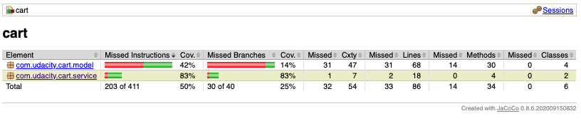
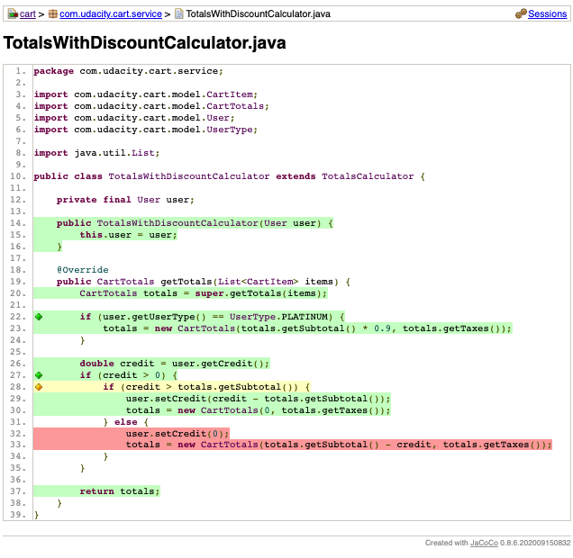
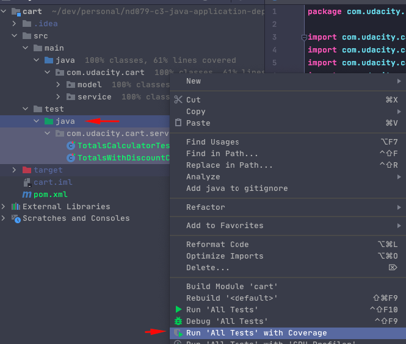
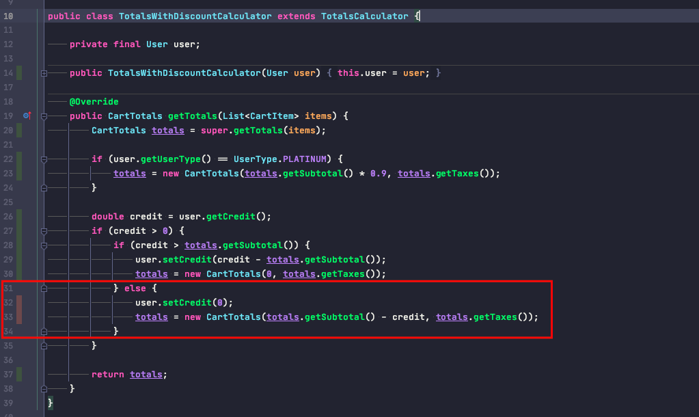

The `cart` folder contains the same project from previous exercises. It's using the JaCoCo plugin.

```
<plugin>
    <groupId>org.jacoco</groupId>
    <artifactId>jacoco-maven-plugin</artifactId>
    <version>0.8.6</version>
</plugin>
```

You can get a coverage report by running:

```
mvn clean jacoco:prepare-agent install jacoco:report
```

The report can be found on 
`target/site/jacoco/index.html`

The model classes mainly contain pojos and the low coverage is because of the equals, hashCode, toString, getter and 
setter methods. Usually, cover those methods is not essential.  



However, if you navigate through services, there's one branch that hasn't been covered:


In the same way, you can use intelliJ to get the same information.



Exercise
1. Add a new test to cover that missing logic.